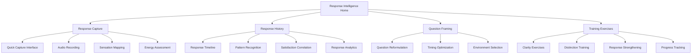

# Response Intelligence (Generators)

## Purpose
Help Generators develop heightened awareness of their Sacral response mechanism, enabling them to make consistently satisfying decisions by recognizing, trusting, and acting upon their authentic gut responses while distinguishing them from mental considerations.

## User Stories & Usage Flows
- As a Generator, I want to track and record my sacral responses to build trust in my authority
- As a Generator, I want to differentiate between genuine sacral responses and mental interference
- As a Generator, I want to correlate my responses with satisfaction outcomes to validate my authority
- As a Generator, I want guidance on framing questions to get clearer sacral responses
- As a Generator, I want to understand my energy patterns to optimize when I make decisions

## Authority-Specific Logic

### Sacral Authority (Primary for Generators)
- **Response Feature:**
  - Immediate gut response capture with sound/vibration recording
  - Physical sensation mapping for response quality
  - Energy level assessment pre/post response
  - Response strength calibration scale

- **Background Logic:**
  - Track response consistency across similar questions/situations
  - Calculate correlation between response strength and outcome satisfaction
  - Identify personal response phonetics (uh-huh, uh-uh, mmm-hmm, etc.)
  - Map physical sensations associated with yes/no responses

- **Response Intelligence:**
  - "Your strongest sacral responses occur when questions are framed as yes/no rather than open-ended"
  - "Physical sensations in your solar plexus correlate with your most accurate responses"
  - "Your response clarity is 40% stronger in morning hours (6-10am)"
  - "Questions framed with 'Does this energize you?' yield clearer responses than 'Do you want this?'"

## Features for Generator Decision-Making

### Sacral Response Capture System
- **Special Focus:**
  - Multi-modal response recording (sound, sensation, energy)
  - Response strength calibration
  - Distortion identification
  - Response timing optimization

- **Unique Features:**
  - "Response Recorder" with audio capture
  - "Strength Calibrator" for response intensity
  - "Distortion Detector" to identify mental interference
  - "Timing Optimizer" for personal peak response times

### Question Framing Assistant
- **Special Focus:**
  - Question reformulation for yes/no clarity
  - Personal response pattern optimization
  - Timing guidance for important questions
  - Environmental optimization for response clarity

- **Unique Features:**
  - "Question Reformulator" for clearer sacral targeting
  - "Pattern Optimizer" based on historical responses
  - "Timing Guide" for optimal decision windows
  - "Environment Optimizer" for response clarity

### Energy Validation System
- **Special Focus:**
  - Energy level tracking pre/post decisions
  - Satisfaction correlation with response alignment
  - Frustration pattern identification
  - Sustainable action planning based on response

- **Unique Features:**
  - "Energy Tracker" for response-action correlation
  - "Satisfaction Correlator" with historical data
  - "Frustration Detector" for response-ignoring patterns
  - "Sustainable Action" planner based on response

### Response Distinctions Library
- **Special Focus:**
  - Mental vs. sacral response differentiation
  - Conditioned vs. authentic response patterns
  - Response quality categorization
  - Personal response vocabulary building

- **Unique Features:**
  - "Response Differentiator" training exercises
  - "Conditioning Detector" for response patterns
  - "Quality Categorizer" for response clarity
  - "Personal Vocabulary" builder for response language

## Variations for Generator Subtypes

### Emotional Generator
- **Special Considerations:**
  - Emotional wave integration with sacral response
  - Clarity timing calculator for emotional+sacral clarity
  - Wave position tracking alongside responses
  - Combined authority decision framework

- **Tailored Features:**
  - "Wave+Response Integrator" for combined authority
  - "Clarity Timer" for emotional+sacral alignment
  - "Wave Position Tracker" alongside responses
  - "Combined Decision" framework and guides

### Classic Generator
- **Special Considerations:**
  - Pure sacral response training
  - Patience development for waiting to respond
  - Energy conservation through response alignment
  - Response-to-action timing optimization

- **Tailored Features:**
  - "Pure Response" training system
  - "Patience Developer" with waiting exercises
  - "Energy Conservation" through response alignment
  - "Response-Action Timer" optimization

### Self-Projected Generator
- **Special Considerations:**
  - Verbal processing integrated with sacral response
  - Speaking-responding feedback loop
  - Voice pattern analysis for response clarity
  - Environment optimization for verbal+sacral clarity

- **Tailored Features:**
  - "Verbal+Sacral Integrator" for combined guidance
  - "Speaking-Response Loop" feedback system
  - "Voice Pattern Analyzer" for response indicators
  - "Environment Optimizer" for verbal+sacral clarity

## Expected Outcomes & User Benefits
- Enhanced confidence in decision-making through consistent sacral validation
- Reduced decision fatigue by simplifying to "yes/no" sacral responses
- Greater energy sustainability by acting only on genuine responses
- Fewer regretted decisions by honoring authentic sacral wisdom
- Improved ability to discern between mental and sacral intelligence
- Heightened awareness of personal response patterns and language
- More satisfying life direction through consistent response-aligned choices

## Friction Elimination Features
- One-tap response recording without lengthy reflection
- Voice-activated response capture for hands-free use
- Automated pattern recognition requiring minimal analysis
- Quick-capture response logging integrated with daily activities
- Contextual question framing suggestions based on situation
- Response strength visualization requiring no manual calibration
- Progressive training exercises that build response awareness

## Backend/API Integration

### Required Endpoints:
- `POST /api/v1/response/capture` - Record a sacral response
  - Payload: `{ question: string, responseType: "yes"|"no"|"neutral", responseStrength: number, audioUrl?: string, energyBefore: number, energyAfter: number, sensations?: string[], context?: object }`
  - Returns: `{ success: boolean, responseId: string, insights?: string[] }`

- `GET /api/v1/response/history` - Get response history with filtering
  - Query parameters: `timeframe: string, responseType?: string, category?: string, strength?: string`
  - Returns: `{ responses: Response[], patterns: ResponsePattern[] }`

- `GET /api/v1/response/satisfaction` - Get satisfaction analytics for responses
  - Query parameters: `timeframe: string, includeUnrated: boolean`
  - Returns: `{ satisfactionMetrics: SatisfactionMetrics, correlations: ResponseCorrelation[] }`

- `POST /api/v1/response/question-framing` - Get optimized question framing
  - Payload: `{ originalQuestion: string, context: string, importance: number }`
  - Returns: `{ reframedQuestions: string[], bestTiming: string, environmentTips: string[] }`

- `GET /api/v1/response/training` - Get personalized response training exercises
  - Query parameters: `focus: string, level: number`
  - Returns: `{ exercises: Exercise[], progress: ProgressMetrics }`

- `POST /api/v1/response/satisfaction-feedback` - Record satisfaction with response-based decision
  - Payload: `{ responseId: string, satisfaction: number, notes: string, outcomes: string[] }`
  - Returns: `{ success: boolean, updatedInsights: string[] }`

### Data Models:
```typescript
interface Response {
  id: string;
  userId: string;
  timestamp: string;
  question: string;
  responseType: "yes" | "no" | "neutral" | "unclear";
  responseStrength: number; // 0-10
  audioUrl?: string;
  energy: {
    before: number; // 0-10
    after: number; // 0-10
    shift: number; // -10 to 10
  };
  physical: {
    sensations: string[];
    locations: string[];
    intensity: number; // 0-10
  };
  context: {
    category: string;
    environment: string;
    timeOfDay: string;
    emotionalState?: string;
    importance: number; // 0-10
  };
  distortion: {
    detected: boolean;
    type?: string; // "mental", "emotional", "conditioning", etc.
    notes?: string;
  };
  satisfaction?: {
    level: number; // 0-10
    notes: string;
    recordedAt: string;
    outcomes: string[];
  };
}

interface ResponsePattern {
  id: string;
  description: string;
  confidence: number; // 0-1
  attributes: {
    responseTypes: string[];
    categories: string[];
    timesOfDay: string[];
    environments: string[];
    physicalIndicators: string[];
  };
  metrics: {
    consistency: number; // 0-1
    satisfaction: number; // 0-1
    energyImpact: number; // -10 to 10
    distortionFrequency: number; // 0-1
  };
  recommendations: string[];
}

interface SatisfactionMetrics {
  overall: number; // 0-1
  byResponseType: Record<string, number>;
  byResponseStrength: Record<string, number>;
  byCategory: Record<string, number>;
  byTimeOfDay: Record<string, number>;
  byEnvironment: Record<string, number>;
  trend: {
    direction: "improving" | "declining" | "stable";
    rate: number; // change per week
  };
}

interface ResponseCorrelation {
  factor: string;
  correlationStrength: number; // -1 to 1
  confidence: number; // 0-1
  description: string;
  recommendation?: string;
}

interface Exercise {
  id: string;
  title: string;
  description: string;
  steps: string[];
  purpose: string;
  duration: number; // minutes
  difficulty: number; // 1-5
  focus: string; // "clarity", "strength", "differentiation", etc.
  completionMetric: string;
}

interface ProgressMetrics {
  responseClarity: number; // 0-1
  satisfactionAlignment: number; // 0-1
  distortionAwareness: number; // 0-1
  completedExercises: number;
  recommendedFocus: string[];
}
```

## Edge Cases & Validation
- Handle unclear or mixed responses with appropriate guidance
- Support varying response intensities and personal response "languages"
- Account for emotional state influence on sacral clarity
- Validate response patterns with statistical significance
- Handle response evolution as awareness develops
- Support authority integration for emotional+sacral combinations
- Process timing variations for response clarity
- Manage environmental factors affecting response quality

## Wireframe Sketch



## Developer Notes
- Implement multi-modal response recording with audio processing capabilities
- Create adaptive pattern recognition that improves with user data
- Design satisfaction correlation algorithms with statistical validation
- Build question framing AI that learns from user's response patterns
- Implement audio analysis to detect vocal response characteristics
- Create physical sensation mapping with intuitive body visualization
- Design progressive training exercises that adapt to user development
- Consider integration with calendar and reminder systems for response timing

## Natural Usage Examples

### Classic Generator
- Question capture: "Should I accept this job offer?" + Sacral response: Audio "Uh-huh" (Yes) + Strength: 8/10 + Energy shift: +3
- Question framing: Original: "What career should I pursue?" → Reframed: "Does working with technology energize me?" "Does helping people directly energize me?"
- Response pattern: "Your strongest sacral responses occur between 8-10am and show 85% satisfaction correlation"
- Training exercise: "Response distinction practice - Listen to 10 pairs of authentic vs. mental responses and identify which is which"

### Emotional Generator
- Combined authority check: Question with emotional wave position "Mid-descending" + Sacral response: "Yes" + Flag: "Consider rechecking when emotional wave reaches neutral position"
- Satisfaction correlation: "Decisions made with aligned emotional+sacral responses show 80% higher satisfaction than sacral-only responses"
- Wave pattern: "Your sacral clarity is consistently highest 1-2 days after emotional peaks"
- Integration practice: "Track sacral responses to the same question across different emotional wave positions to identify consistent responses"

### Self-Projected Generator
- Verbal processing: Voice note exploration of options + Sacral response: "Yes" to specific segment at 1:45 in recording
- Speaking pattern: "Your sacral response activates most clearly after speaking about options for 3-5 minutes"
- Environment insight: "Solo verbal processing in quiet environments yields 40% clearer sacral responses than group discussions"
- Integration practice: "Record yourself talking through options, noting when your voice tone/energy shifts, then check sacral response at those moments"
</content>
</invoke>
