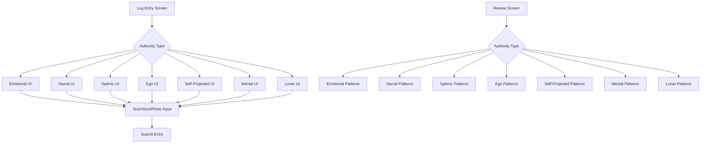

# Living Log

## Purpose
Capture authentic user experiences without performance pressure or self-consciousness, enabling natural pattern recognition over time and building decision-making wisdom through documented personal experiences.

## User Stories & Usage Flows
- As a user, I want to quickly capture a moment, thought, or feeling via text, voice, or photo so I can track my authentic experiences
- As a user, I want the entry interface to adapt to my Human Design authority for more meaningful logs
- As a user, I want to review past logs with insights specific to my authority type to recognize patterns
- As a user, I want log entries to be timestamped and categorized based on my authority's needs without requiring manual tagging

## Authority-Specific Logic

### Emotional Authority
- **Entry UI/Prompt:**
  - Display prominent "emotional weather" tag selection at the top of entry screen (e.g., stormy, calm, high, low)
  - Include a "current wave position" slider or visual indicator
  - Prompt: "Check in: What are you feeling now?"

- **Background Logic:**
  - Timestamp all entries for emotional cycle tracking
  - Tag entries with selected emotional state
  - Track emotional peaks and valleys over time

- **Later Surfacing:**
  - Highlight entries made at clarity points (72h after peak, or user-marked clarity)
  - Surface pattern recognition: "You tend to feel regret when deciding at emotional peaks"
  - Prompt user during review: "Is this a clarity moment?" for specific entries 1-3 days after peak

### Sacral Authority
- **Entry UI/Prompt:**
  - Include prominent "gut check" button with quick Yes/No/Unsure response
  - Add "Energy state" indicator: "Did your energy go up, down, or stay flat?"
  - Prompt: "What's your gut say right now?"

- **Background Logic:**
  - Tag each entry with response/energy state
  - Track energy patterns relative to activities/situations
  - Look for patterns in "yes" responses

- **Later Surfacing:**
  - Cluster "Yes" responses: "Here's where your gut said yes most often"
  - Highlight energy peaks and valleys with associated circumstances
  - Surface patterns in gut responses over time

### Splenic Authority
- **Entry UI/Prompt:**
  - Include fast "Intuitive Hit" toggle: "Did you get a flash of knowing/instinct?" Yes/No
  - Optional: "What did your body feel?" slider or word input
  - Prompt: "Was there a subtle 'yes/no' in your body?"

- **Background Logic:**
  - Timestamp splenic hits for later correlation
  - Track physical sensations mentioned with intuitions
  - Tag entries with intuition strength or clarity

- **Later Surfacing:**
  - Show "Most accurate instincts" as validated by later experiences
  - Prompt for validation of past instincts: "Did this intuition prove accurate?"
  - Track correlations between physical sensations and accurate intuitions

### Ego Authority
- **Entry UI/Prompt:**
  - Include "Desire check": "Did you want this? Was this a true desire or willpower moment?" Yes/No
  - Add "Will strength" indicator (0-10)
  - Prompt: "Was this driven by real want, or for someone else?"

- **Background Logic:**
  - Tag entries with willpower/desire indicators
  - Track alignment between actions and true desire
  - Identify patterns where willpower was used contrary to desire

- **Later Surfacing:**
  - Surface "Entries where your will was strongest" 
  - Highlight "Where you went against your true desire"
  - Correlate willpower strength with satisfaction in outcomes

### Self-Projected Authority
- **Entry UI/Prompt:**
  - Add "Talked out loud?" toggle with "How did this feel when spoken?" input
  - Include voice note recording capability
  - Prompt: "Did you talk this out loud or internally? How did it resonate when you spoke/thought it?"

- **Background Logic:**
  - Tag entries by spoken vs. internal processing
  - Track clarity changes before/after speaking
  - Note environments/people present during spoken processing

- **Later Surfacing:**
  - Highlight moments where speaking led to clarity or indecision
  - Surface patterns: "Speaking with X often brings you clarity"
  - Track effectiveness of different speaking environments

### Mental Authority
- **Entry UI/Prompt:**
  - Include environmental context fields: "Who were you with? Where were you? What was the vibe?"
  - Prompt for dialogue results: "What insights came from discussion?"
  - Prompt: "Did you discuss this with a trusted ally? What perspectives emerged?"

- **Background Logic:**
  - Tag entries with environmental factors and social context
  - Track clarity across different environments and discussion partners
  - Note time between discussion and clarity

- **Later Surfacing:**
  - Highlight "Best clarity" environments and discussion partners
  - Surface patterns: "You gain clarity fastest when X" 
  - Show correlation between different discussion partners and decision satisfaction

### Lunar (Reflector) Authority
- **Entry UI/Prompt:**
  - Include contextual tagging: "Who were you with? Where were you? What was the vibe?"
  - Auto-tag with lunar phase
  - Prompt: "Where are you? Who's here? What's the feel?"

- **Background Logic:**
  - Tag log with lunar phase/date and environmental notes
  - Track patterns across the 28-day lunar cycle
  - Correlate environmental factors with well-being

- **Later Surfacing:**
  - Show patterns across lunar cycle: "Your best days for clarity are 3 days after full moon"
  - Highlight environmental influences: "You feel most clear with X people/environment"
  - Present 28-day pattern reviews for major decisions

## Expected Outcomes & User Benefits
- Authentic pattern recognition over time without forced analysis
- Reduced decision anxiety through documented personal wisdom
- Natural awareness building without self-conscious introspection
- Growing database of personal experiences tied to authority-specific insights
- Improved decision-making aligned with personal authority

## Friction Elimination Features
- Single-tap entry with minimal required fields
- Authority-specific UI that prompts only relevant questions
- No multi-step forms or mandatory categorization
- Natural language processing for automatic tagging
- Optional context additions rather than required fields
- Voice-to-text for hands-free capture
- Photo + caption for visual moments
- Contextual reminders based on authority type

## Backend/API Integration

### Required Endpoints:
- `POST /api/v1/logs/entries` - Create log entry
  - Payload: `{ content: string, type: "text"|"voice"|"photo", authorityData: object, context?: object }`
  - Returns: `{ success: boolean, entry_id: string }`

- `GET /api/v1/logs/entries` - Get log entries with filtering
  - Query parameters: `startDate, endDate, tag, authorityState, clarity`
  - Returns: `{ entries: LogEntry[], totalCount: number }`

- `GET /api/v1/logs/patterns` - Get authority-specific patterns
  - Query parameters: `timeframe: "week"|"month"|"year", authority: string`
  - Returns: `{ patterns: Pattern[], insights: string[] }`

- `GET /api/v1/user/authority` - Get user's authority type
  - Returns: `{ authority: string, guidanceText: string }`

- `PUT /api/v1/logs/entries/:entryId/authority-feedback` - Update entry with authority-specific feedback
  - Payload: `{ clarityLevel?: number, wasAccurate?: boolean, reflectionNotes?: string }`
  - Returns: `{ success: boolean }`

### Data Models:
```typescript
interface LogEntry {
  id: string;
  userId: string;
  content: string;
  mediaType: "text" | "voice" | "photo";
  mediaUrl?: string;
  timestamp: string;
  authorityData: {
    type: string; // "emotional", "sacral", "splenic", etc.
    state?: string; // e.g. "high", "low", "yes", "no"
    intensity?: number; // 0-10 scale where applicable
    context?: object; // Authority-specific context
  };
  tags?: string[];
  context?: {
    location?: string;
    people?: string[];
    environment?: string;
    lunarPhase?: string;
  };
  clarityMarker?: {
    isClarity: boolean;
    markedAt: string;
    notes?: string;
  };
}

interface Pattern {
  id: string;
  description: string;
  confidence: number; // 0-1
  relatedEntryIds: string[];
  authorityType: string;
  patternType: string; // "emotional-clarity", "gut-response", etc.
  discoveredAt: string;
}
```

## Edge Cases & Validation
- Handle offline mode with local storage and later synchronization
- Implement privacy controls for sensitive entries
- Validate authority-specific inputs based on user's actual authority type
- Handle incomplete entries with smart defaults based on authority type
- Ensure lunar phase calculations are accurate for Reflectors
- Gracefully handle authority type changes (rare but possible)

## Wireframe Sketch



## Developer Notes
- Implement a flexible database schema that allows for authority-specific data fields
- Create a shared component library for authority-specific UI elements
- Use background tasks for pattern recognition and insights generation
- Consider implementing machine learning for pattern recognition as data grows
- Ensure timestamp normalization across timezones for accurate emotional/lunar cycle tracking
- Create testable authority-specific logic modules
- Track metrics on which authority types use which input methods most frequently

## Natural Usage Examples

### Emotional Authority
- Morning log: "Feeling low energy today but emotionally neutral" + Emotional state tag: "Neutral"
- After meeting: "Team conflict made me anxious about the project timeline" + Emotional state tag: "Stormy"
- 3 days later: System prompt: "You noted emotional storm 3 days ago. Are you feeling clarity now about that project timeline issue?"

### Sacral Authority
- Job offer review: "Got offer from Company X" + Gut response: "Yes" + Energy: "Up"
- Social invitation: "Friend asked to go hiking Saturday" + Gut response: "No" + Energy: "Flat"
- Weekly review shows: "Your gut consistently says yes to outdoor activities but no to extended social events"

### Splenic Authority
- Business partnership: "Meeting with potential partner" + Intuitive hit: "Yes, felt warm sensation in chest"
- Home purchase: "Viewed house on Oak Street" + Intuitive hit: "No, felt constriction in throat"
- Later validation: "Oak Street house had hidden foundation issues discovered in inspection. Trust that throat constriction!"

### Ego Authority
- Work project: "Asked to lead new initiative" + True desire: "Yes, I genuinely want this" + Will strength: 8
- Family obligation: "Promised to host holiday dinner" + True desire: "No, did it to please others" + Will strength: 6
- Pattern insight: "You feel most fulfilled when leading initiatives that align with your true desires, not obligations"
