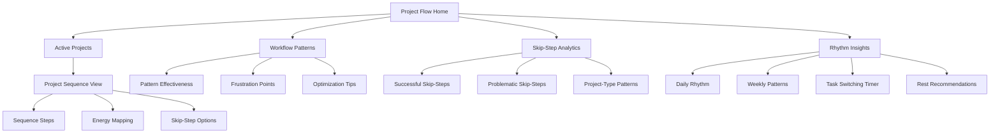

# Project Flow Dynamics (Manifesting Generators)

## Purpose
Help Manifesting Generators leverage their unique multi-tasking capabilities and skip-step efficiency while avoiding burnout, frustration, and collapse by providing dynamic project sequencing, energy allocation insights, and responsive workflow tools.

## User Stories & Usage Flows
- As a Manifesting Generator, I want to track multiple project sequences simultaneously
- As a Manifesting Generator, I want to identify optimal skip-steps that enhance efficiency vs. ones that create problems
- As a Manifesting Generator, I want to understand my unique energy allocation patterns across different tasks
- As a Manifesting Generator, I want to reduce frustration by visualizing my natural workflow rhythm
- As a Manifesting Generator, I want to identify when I'm most efficient at task switching vs. focused work

## Authority-Specific Logic

### Sacral Authority (Primary for Manifesting Generators)
- **Flow Feature:**
  - Multi-project sacral response tracker
  - Skip-step suggestion with sacral validation
  - Energy-to-task mapping with sacral feedback
  - Quick task resequencing based on spontaneous gut responses

- **Background Logic:**
  - Track energy fluctuation across task switching
  - Identify optimal sequencing based on sacral response
  - Calculate effectiveness of different skip-step patterns
  - Map frustration incidents against flow interruptions

- **Flow Intelligence:**
  - "Skip-stepping past planning phase works well for creative projects but not for collaborative ones"
  - "Your energy sustains longest when switching tasks every 30-45 minutes"
  - "Task sequences validated by strong sacral responses show 60% higher completion rates"
  - "Your most efficient workflow pattern: burst → review → burst → complete"

### Emotional Authority (For Emotional Manifesting Generators)
- **Flow Feature:**
  - Emotional wave + task sequence correlation
  - Best task types for different emotional states
  - Waiting period integration for sequential decisions
  - Energy+emotion task allocation advisor

- **Background Logic:**
  - Track task performance across emotional wave position
  - Identify optimal emotional states for different task types
  - Calculate personalized waiting periods between sequence stages
  - Map frustration points related to emotional+workflow misalignment

- **Flow Intelligence:**
  - "Creative tasks show highest efficiency during emotional highs"
  - "Detail work is best suited to emotional neutral or slightly low states"
  - "Decision sequences benefit from 8-12 hour pauses at key points"
  - "Your optimal project initiation typically follows 1-2 days after emotional clarity"

### Splenic Authority (For Some Split-Definition Manifesting Generators)
- **Flow Feature:**
  - Safety check integration in project sequences
  - Intuitive flash capture for sequence adjustments
  - Risk assessment in skip-step suggestions
  - Body intelligence feedback for workflow pacing

- **Background Logic:**
  - Track intuitive interventions in workflow sequences
  - Identify safety patterns in successful vs. problematic skip-steps
  - Calculate risk factors in different sequence approaches
  - Map physical sensations related to flow alignment

- **Flow Intelligence:**
  - "Your intuition most frequently flags sequence issues in collaborative projects"
  - "Skip-steps that trigger body discomfort show 70% higher problem rates later"
  - "Your splenic hits about timing adjustments prove accurate in 85% of cases"
  - "Your body signals workflow alignment through throat relaxation and chest warmth"

## Features for Manifesting Generator Workflow

### Multi-Tasking Optimization
- **Special Focus:**
  - Optimal task switching frequency personalization
  - Context retention techniques between switches
  - Energy conservation during transitions
  - Multi-project priority balancing

- **Unique Features:**
  - "Task Switch Timer" customized to personal rhythm
  - "Context Retention" quick notes system
  - "Energy Transition" mini-breaks recommendation
  - "Multi-Project Dashboard" with energy allocation visualization

### Skip-Step Intelligence
- **Special Focus:**
  - Skip-step pattern recognition across project types
  - Problem prevention through strategic completeness
  - Efficiency gain quantification from skipping vs. completion
  - Communication tools for explaining skip-steps to others

- **Unique Features:**
  - "Skip-Step Analyzer" showing outcomes from previous patterns
  - "Completion Checklist" for essential vs. optional steps
  - "Skip-Step Communication" template generator
  - "Efficiency Calculator" comparing full process vs. skip-step approach

### Frustration Prevention
- **Special Focus:**
  - Early frustration detection
  - Flow interruption identification and solutions
  - Energy renewal strategies during blocked sequences
  - Communication templates for boundary setting

- **Unique Features:**
  - "Frustration Early Warning" system
  - "Flow Blocker" identification tool
  - "Energy Reset" micro-practices library
  - "Boundary Communication" scripts for different scenarios

### Sacral Rhythm Integration
- **Special Focus:**
  - Natural work/rest rhythm tracking
  - Satisfaction correlation with rhythm alignment
  - Energy conservation through rhythm-matched scheduling
  - Authority-aligned decision sequencing

- **Unique Features:**
  - "Rhythm Detector" for personal work/rest patterns
  - "Satisfaction Tracker" correlated with rhythm adherence
  - "Energy Conservation" through predictive scheduling
  - "Decision Sequence" optimizer based on sacral authority

## Expected Outcomes & User Benefits
- Decreased frustration through aligned workflow processes
- Improved energy sustainability across multiple projects
- Higher project completion satisfaction
- Clear identification of optimal vs. problematic skip-steps
- Reduced conflict with collaborators through better communication
- Increased productivity through natural rhythm alignment
- Enhanced decision sequencing matching authority type

## Friction Elimination Features
- One-tap workflow state capture
- Automatic task switching reminders tuned to personal rhythm
- Voice memo integration for spontaneous project insights
- Calendar integration for rhythm-aligned scheduling
- Quick-capture frustration logging with pattern detection
- Template generator for explaining MG workflow to others
- Progressive skip-step advisor that learns from outcomes

## Backend/API Integration

### Required Endpoints:
- `POST /api/v1/workflow/sequence` - Record project sequence step
  - Payload: `{ projectId: string, sequenceStep: string, isSkipStep: boolean, energyLevel: number, sacralResponse: string, emotionalState?: string, notes?: string }`
  - Returns: `{ success: boolean, sequenceId: string, nextStepSuggestions?: string[] }`

- `GET /api/v1/workflow/patterns` - Get workflow pattern analytics
  - Query parameters: `timeframe: string, projectType: string, includeSkipSteps: boolean`
  - Returns: `{ patterns: WorkflowPattern[], insights: string[], frustrationPoints: FrustrationPoint[] }`

- `GET /api/v1/workflow/skip-steps` - Get skip-step analytics
  - Query parameters: `effectiveness: "positive"|"negative"|"all", projectType?: string`
  - Returns: `{ skipStepPatterns: SkipStepPattern[], recommendations: string[] }`

- `POST /api/v1/workflow/frustration` - Record frustration point
  - Payload: `{ projectId: string, sequenceStep: string, frustrationLevel: number, blockers: string[], context: object }`
  - Returns: `{ success: boolean, similarPatterns?: FrustrationPattern[], recommendations?: string[] }`

- `GET /api/v1/workflow/rhythm` - Get personal workflow rhythm
  - Query parameters: `resolution: "day"|"week"|"hour"`
  - Returns: `{ rhythmPatterns: RhythmPattern[], optimalSwitchTimes: string[], restPeriods: string[] }`

### Data Models:
```typescript
interface WorkflowSequence {
  id: string;
  userId: string;
  projectId: string;
  timestamp: string;
  sequenceStep: string;
  isSkipStep: boolean;
  energyLevel: number; // 1-10
  sacralResponse: string; // "yes", "no", "neutral"
  emotionalState?: string;
  splenicInput?: string;
  context: {
    projectType: string;
    collaborators: boolean;
    deadline?: string;
    priority: number;
    location?: string;
    concurrent: boolean; // Whether working on multiple projects
  };
  outcomes: {
    completionSuccess?: boolean;
    satisfactionLevel?: number;
    timeEfficiency?: number;
    energyEfficiency?: number;
    frustrationPoints?: string[];
  };
}

interface WorkflowPattern {
  id: string;
  description: string;
  confidence: number; // 0-1
  projectTypes: string[];
  steps: {
    sequence: string[];
    skipSteps: string[];
    keyPoints: string[];
  };
  metrics: {
    completionRate: number;
    averageSatisfaction: number;
    frustrationRate: number;
    energyEfficiency: number;
  };
}

interface SkipStepPattern {
  id: string;
  description: string;
  skippedStep: string;
  projectTypes: string[];
  effectiveness: "positive" | "negative" | "neutral";
  confidence: number; // 0-1
  impact: {
    timeImpact: number; // hours saved/lost
    qualityImpact: number; // -5 to 5
    frustrationImpact: number; // -5 to 5
    collaborationImpact: number; // -5 to 5
  };
  recommendedFor: string[];
  cautionsFor: string[];
}

interface FrustrationPoint {
  id: string;
  timestamp: string;
  projectId: string;
  sequenceStep: string;
  frustrationLevel: number; // 1-10
  blockers: string[];
  context: {
    projectType: string;
    environment: string;
    collaborators?: string[];
    energyLevel: number;
    emotionalState?: string;
  };
  resolution?: {
    resolved: boolean;
    strategy: string;
    effectiveness: number;
    timeToResolution: number; // minutes
  };
}

interface RhythmPattern {
  id: string;
  pattern: string; // e.g., "burst-pause-burst-complete"
  timeOfDay: string[];
  durationMinutes: {
    focus: number;
    transition: number;
    rest: number;
  };
  effectiveness: {
    energySustainability: number;
    completionRate: number;
    satisfactionLevel: number;
  };
  projectTypeMatch: Record<string, number>; // project type to effectiveness score
}
```

## Edge Cases & Validation
- Handle irregular work patterns with adaptive rhythm detection
- Support both sequential and parallel project structures
- Account for energy fluctuations due to external factors
- Validate skip-step patterns with statistical significance
- Handle collaborative vs. solo project differences
- Support authority type variations with appropriate strategy
- Process frustration patterns for meaningful intervention
- Manage deadline pressure with appropriate skip-step advice

## Wireframe Sketch



## Developer Notes
- Implement adaptive workflow tracking that minimizes manual input
- Create skip-step analytics with statistical validation parameters
- Design project visualization that supports both linear and non-linear sequences
- Build frustration tracking with actionable intervention points
- Implement rhythm detection algorithms with minimal data requirements
- Create authority integration modules for different MG authority types
- Design communication templates for explaining MG workflow to collaborators
- Consider integration points with calendar and project management tools

## Natural Usage Examples

### Sacral Authority MG
- Project flow capture: "Website redesign" → Captured sequence: Research→Design (skipped planning) → Development → Testing (skipped documentation) → Launch
- Skip-step insight: "Skipping planning phases works well for solo creative projects but creates 40% more revision work in collaborative projects"
- Rhythm insight: "Your optimal task switching frequency is 35-45 minutes with 5-minute transitions"
- Frustration prevention: "Warning: Current project sequence shows 3 hallmarks of your typical frustration pattern. Consider adding a brief review step after the design phase."

### Emotional Authority MG
- Multi-project view: 3 active projects with emotional state overlay showing best task matches for current wave position
- Decision sequence: Major project decision with waiting period integration showing optimal 24-hour pause before committing
- Flow adjustment: "Your emotional state indicates optimal conditions for creative tasks but cautions against detail work for approximately 12 hours"
- Pattern insight: "You consistently complete projects with higher satisfaction when initial decisions are made during emotional clarity periods"

### Splenic Authority MG
- Skip-step safety check: "This skip-step pattern has previously triggered splenic warnings in similar projects"
- Intuition integration: Quick splenic response capture for sequence adjustment with risk assessment
- Body feedback: Physical sensation mapping showing alignment/misalignment with current workflow
- Pattern insight: "Your spontaneous workflow adjustments are most accurate when accompanied by throat or solar plexus sensations"
</content>
</invoke>
