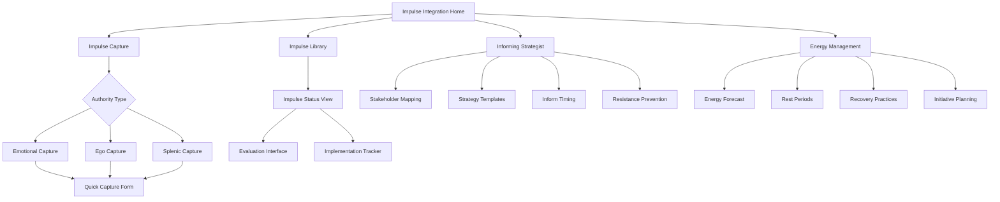

# Impulse Integration (Manifestors)

## Purpose
Help Manifestors harness their natural initiating power by capturing, evaluating, and implementing creative impulses with proper timing and strategic communication while minimizing resistance and maximizing impact.

## User Stories & Usage Flows
- As a Manifestor, I want to capture spontaneous impulses before they fade or get suppressed
- As a Manifestor, I want to evaluate which impulses are most aligned with my authentic path
- As a Manifestor, I want to develop effective informing strategies to reduce resistance to my initiatives
- As a Manifestor, I want to track my energy cycles to time my actions for maximum impact
- As a Manifestor, I want to distinguish between conditioned responses and true initiating impulses

## Authority-Specific Logic

### Emotional Authority (Common for Manifestors)
- **Impulse Feature:**
  - Emotion-aware impulse capture
  - Impulse evaluation against emotional wave position
  - Strategic waiting period integration
  - Impact projection based on emotional clarity

- **Background Logic:**
  - Track impulse emergence against emotional wave
  - Calculate ideal waiting periods for different impulse types
  - Identify emotional states producing most sustainable impulses
  - Map resistance patterns to emotional state during informing

- **Integration Intelligence:**
  - "This impulse emerged during emotional high - flag for reevaluation during clarity"
  - "Based on your pattern, waiting 36-48 hours will provide emotional clarity on this initiative"
  - "Impulses that persist across full emotional wave show highest sustainability"
  - "Historical data shows informing during emotional neutral state reduces resistance by 40%"

### Ego Authority (Common for Manifestors)
- **Impulse Feature:**
  - Desire vs willpower impulse classification
  - Commitment sustainability projection
  - Heart-centered authenticity check
  - Strategic willpower allocation advisor

- **Background Logic:**
  - Distinguish between heart-centered vs ego-driven impulses
  - Calculate commitment sustainability based on desire authenticity
  - Identify willpower cycles and optimal initiation timing
  - Map resistance patterns related to desire vs control dynamics

- **Integration Intelligence:**
  - "This impulse aligns with your core desires rather than external expectations"
  - "Similar initiatives show higher sustainability when based in true desire vs willpower"
  - "Your willpower is currently in renewal phase - consider delaying high-effort informing"
  - "Projects initiated from authentic desire show 70% less resistance from others"

### Splenic Authority (Common for Manifestors)
- **Impulse Feature:**
  - In-the-moment impulse validation
  - Safety and alignment intuition check
  - Spontaneous timing optimization
  - Clarity on what/when to inform based on intuitive hits

- **Background Logic:**
  - Track spontaneous impulse-to-action timing effectiveness
  - Identify physical sensation patterns related to aligned impulses
  - Calculate optimal informing approach based on intuitive signals
  - Map health impacts of following vs ignoring splenic impulses

- **Integration Intelligence:**
  - "This impulse triggered strong splenic signal - consider immediate, focused action"
  - "Your body is signaling caution - potential resistance factor identified"
  - "Splenic impulses implemented within 24 hours show 60% higher completion rate"
  - "Historical pattern shows throat constriction when informing approach needs adjustment"

## Features for Manifestor Initiation

### Impulse Capture System
- **Special Focus:**
  - Lightning-fast impulse recording
  - Impulse categorization by impact scope
  - Emotional/authority state tagging
  - Impulse preservation without dilution

- **Unique Features:**
  - "Impulse Snapshot" quick capture tool
  - "Impact Scope" classifier (personal/relational/collective)
  - "Authority State" automatic tagging
  - "Impulse Archive" for revisiting untapped inspirations

### Strategic Informing Guide
- **Special Focus:**
  - Personalized informing templates by relationship type
  - Timing optimizer for different stakeholder types
  - Resistance pattern recognition and prevention
  - Informing effectiveness tracking

- **Unique Features:**
  - "Inform Script" generator for different contexts
  - "Timing Strategist" for optimal informing moments
  - "Resistance Radar" warning system
  - "Inform-Impact Tracker" for effectiveness analysis

### Energy Conservation System
- **Special Focus:**
  - Initiation energy cost calculation
  - Rest cycle identification and protection
  - Energy renewal practice recommendations
  - Context-specific energy expenditure guidance

- **Unique Features:**
  - "Energy Forecast" for initiative planning
  - "Rest Defender" for critical recovery periods
  - "Renewal Practice" personalized recommendations
  - "Energy ROI" calculator for initiatives

### Peace & Impact Integration
- **Special Focus:**
  - Peace-to-impact ratio optimization
  - Inner authority alignment validation
  - Initiative sustainability projections
  - Anger/frustration prevention system

- **Unique Features:**
  - "Peace-Impact Balance" analyzer
  - "Authority Alignment" verification tool
  - "Sustainability Predictor" for initiatives
  - "Anger Prevention" early warning system

## Authority-Type Variations

### Emotional Manifestor
- **Special Considerations:**
  - Emotional wave tracking integrated with impulse system
  - Clarity timing calculator for different impulse types
  - Emotional transparency in informing strategies
  - Wave-aware energy conservation planning

- **Tailored Features:**
  - "Wave Position" indicator alongside impulses
  - "Clarity Window" predictor for decisions
  - "Emotional Context" for informing templates
  - "Wave-Energy Correlation" tracker

### Ego Manifestor
- **Special Considerations:**
  - True desire verification for impulses
  - Willpower reserve monitoring and alerts
  - Authentic vs projected self differentiation
  - Heart-centered communication strategies

- **Tailored Features:**
  - "Desire Authenticity" verification tool
  - "Willpower Reserve" gauge and alerts
  - "Authentic Self" alignment checker
  - "Heart-Centered Communication" templates

### Splenic Manifestor
- **Special Considerations:**
  - Immediate impulse validation system
  - Safety-awareness in initiative planning
  - In-the-moment informing guidance
  - Health-impact monitoring of actions/inactions

- **Tailored Features:**
  - "Immediate Validation" system for impulses
  - "Safety Scanner" for initiatives
  - "Spontaneous Inform" guidance
  - "Health Alignment" tracker

## Expected Outcomes & User Benefits
- Increased confidence in distinguishing and acting on authentic impulses
- Reduced resistance through effective, well-timed informing
- Improved energy sustainability and prevention of burnout
- Greater peace while maintaining impactful initiation
- Enhanced alignment between impulses and inner authority
- Decreased anger and frustration through strategic action
- More sustainable initiatives through proper evaluation and timing

## Friction Elimination Features
- Single-tap impulse capture with voice-to-text
- Automated authority state detection where possible
- Context-aware informing suggestions
- Predictive resistance warnings
- Streamlined impulse-to-action workflows
- Calendar integration for strategic timing
- Energy-aware notification system

## Backend/API Integration

### Required Endpoints:
- `POST /api/v1/impulse/capture` - Record a manifestor impulse
  - Payload: `{ impulseDescription: string, impactScope: string, urgencyLevel: number, authorityState: object, context?: object }`
  - Returns: `{ success: boolean, impulseId: string, evaluationTips?: string[] }`

- `GET /api/v1/impulse/library` - Get captured impulses with filtering
  - Query parameters: `status: "new"|"evaluated"|"informed"|"implemented"|"abandoned", timeframe: string, impactScope?: string`
  - Returns: `{ impulses: Impulse[], patterns: ImpulsePattern[] }`

- `POST /api/v1/impulse/evaluate` - Evaluate an impulse against authority
  - Payload: `{ impulseId: string, authorityInput: object, alignmentScore: number, notes: string }`
  - Returns: `{ success: boolean, evaluationSummary: object, implementationSuggestions?: string[] }`

- `POST /api/v1/impulse/inform` - Record an informing action
  - Payload: `{ impulseId: string, stakeholders: string[], informMethod: string, informContent: string, timing: object }`
  - Returns: `{ success: boolean, informId: string, resistancePrediction?: object }`

- `GET /api/v1/impulse/inform-strategies` - Get personalized informing strategies
  - Query parameters: `stakeholderType: string, impulseScope: string, authorityType: string`
  - Returns: `{ strategies: InformStrategy[], templates: string[], timing: TimingGuidance }`

- `GET /api/v1/impulse/energy-forecast` - Get energy forecast for initiating
  - Query parameters: `timeframe: "day"|"week"|"month"`
  - Returns: `{ energyForecast: EnergyPeriod[], optimalWindows: string[], restPeriods: string[] }`

### Data Models:
```typescript
interface Impulse {
  id: string;
  userId: string;
  timestamp: string;
  description: string;
  impactScope: "personal" | "relational" | "collective" | "creative";
  urgencyLevel: number; // 1-10
  authorityState: {
    type: string; // "emotional", "ego", "splenic"
    state?: string; // Authority-specific state
    clarity?: number; // 0-1 scale
  };
  status: "new" | "evaluated" | "informed" | "implemented" | "abandoned";
  evaluation?: {
    alignmentScore: number;
    authorityInput: object;
    sustainability: number;
    implementationNotes: string;
    evaluatedAt: string;
  };
  informing?: {
    informedAt: string;
    stakeholders: string[];
    method: string;
    content: string;
    resistanceLevel?: number;
    feedback?: string;
  };
  implementation?: {
    startedAt: string;
    completedAt?: string;
    success?: boolean;
    energy: {
      required: number;
      actual: number;
      recovery: number;
    };
    impact: {
      personal: number;
      others: number;
      satisfaction: number;
    };
  };
  context?: {
    location?: string;
    environment?: string;
    triggers?: string[];
    energyState?: string;
  };
}

interface ImpulsePattern {
  id: string;
  description: string;
  category: string;
  confidence: number; // 0-1
  attributes: {
    authorityState: string[];
    timing: object;
    impactScope: string[];
    successFactors: string[];
    resistanceFactors: string[];
  };
  metrics: {
    implementationRate: number;
    averageAlignment: number;
    resistanceLevel: number;
    energyEfficiency: number;
    satisfactionLevel: number;
  };
}

interface InformStrategy {
  id: string;
  strategyName: string;
  description: string;
  stakeholderTypes: string[];
  authorityAlignment: string[];
  effectivenessScore: number; // 0-1
  timing: {
    idealTime: string[];
    cautionPeriods: string[];
    preparationNeeded: boolean;
  };
  components: {
    openingApproach: string;
    keyElements: string[];
    tonality: string;
    followUp: string;
  };
  adaptations: {
    forResistance: string;
    forMisunderstanding: string;
    forDelayedResponse: string;
  };
}

interface EnergyPeriod {
  startTime: string;
  endTime: string;
  energyLevel: number; // 1-10
  initiationCapacity: number; // 1-10
  recommendedActivity: string[];
  cautionActivity: string[];
  recovery: {
    needed: boolean;
    durationMinutes: number;
    suggestedPractices: string[];
  };
}

interface TimingGuidance {
  optimalTimes: {
    dayOfWeek?: string[];
    timeOfDay?: string[];
    relationToEvent?: string;
  };
  preparationPeriod: {
    minimum: string;
    ideal: string;
  };
  authoritySpecific: {
    waitingPeriod?: string;
    willpowerConsideration?: string;
    splenicTiming?: string;
  };
}
```

## Edge Cases & Validation
- Handle impulse conflict resolution when multiple impulses compete
- Support authority transition during impulse evaluation (e.g., emotional wave movement)
- Account for energy depletion mid-initiative with contingency planning
- Validate impulse authenticity against conditioning patterns
- Handle urgent vs. important impulse prioritization
- Support various informing methods and stakeholder relationships
- Process resistance feedback for future strategy refinement
- Manage serial vs. parallel impulse implementation

## Wireframe Sketch



## Developer Notes
- Implement multi-modal impulse capture (text, voice, image annotation)
- Create authority-specific evaluation algorithms with adaptable parameters
- Design informing template system that maintains authenticity while providing structure
- Build energy forecasting analytics based on activity patterns and recovery needs
- Implement resistance prediction models with feedback loops for improvement
- Create sustainable initiative prediction based on historical data
- Design user experience that feels spacious and non-restrictive for Manifestors
- Consider impulse collection notification system that respects Manifestor independence

## Natural Usage Examples

### Emotional Manifestor
- Impulse capture: "Create a community art space downtown" + Emotional state: "High, excited" → System flags: "Consider reevaluating during emotional clarity in approximately 2-3 days"
- Evaluation: After emotional cycle → "This impulse maintained consistent energy through emotional wave - sustainability prediction: High"
- Informing strategy: "For city officials, prepare informing message during emotional neutral phase, emphasize community benefits first, then share your vision"
- Energy forecast: "Based on your pattern, optimal implementation window begins Friday after adequate rest Thursday evening"

### Ego Manifestor
- Impulse capture: "Change career to wildlife photography" + Desire check: "Strong authentic desire, not external expectation" → Evaluation: "Aligned with true heart desire, sustainability prediction: High"
- Willpower gauge: "Current reserves at 40% - consider strategic informing now but delay implementation start by 3-5 days"
- Informing template: "For family stakeholders: Start with heart-centered 'why', acknowledge impact on others, then share logistical details"
- Implementation guide: "Break initiative into desire-aligned phases to maintain heart connection throughout process"

### Splenic Manifestor
- Impulse capture: "Immediately end business partnership" + Splenic signal: "Strong throat tightening, gut clarity" → System response: "Splenic clarity detected, consider prompt action within 24 hours"
- Safety check: "Previous similar impulses proved accurate and prevented larger issues"
- Informing guidance: "Direct, clear communication recommended within 12 hours. Template provided with safety-focused explanation"
- Health alignment: "Acting on this impulse aligns with previous health improvement patterns after following splenic clarity"
</content>
</invoke>
