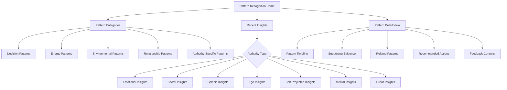

# Pattern Recognition Engine

## Purpose
Automatically identify and reveal personal behavioral and decision-making patterns across time without overwhelming analysis, helping users recognize their natural rhythms, tendencies, and decision strategies aligned with their Human Design authority.

## User Stories & Usage Flows
- As a user, I want to discover meaningful patterns in my decisions and behaviors without manual analysis
- As a user, I want insights about my decision-making patterns based on my Human Design authority type
- As a user, I want to see correlations between my actions, decisions, and outcomes over time
- As a user, I want authority-specific pattern recognition that enhances my self-awareness
- As a user, I want to understand behavioral patterns that support or hinder my authentic decision-making

## Authority-Specific Logic

### Emotional Authority
- **Pattern Recognition Focus:**
  - Emotional wave cycles and their impact on decision quality
  - Correlation between emotional state at decision time and later satisfaction
  - Identification of personal "clarity markers" post-emotional wave
  - Decision regret frequency analysis related to wave position
  
- **Background Logic:**
  - Track decisions against emotional wave position
  - Calculate average time from emotional peak to clarity
  - Identify decision types most vulnerable to wave distortion
  - Map satisfaction ratings against wave position at decision time

- **Pattern Insights:**
  - "You make most regretted decisions at emotional peaks"
  - "Your clarity typically emerges 2-3 days after emotional storms"
  - "Decisions about X made during emotional neutral periods show 80% higher satisfaction"
  - "You tend to commit during emotional highs but later feel uncertain"

### Sacral Authority
- **Pattern Recognition Focus:**
  - Correlation between gut response and outcome satisfaction
  - Energy depletion patterns when ignoring sacral responses
  - Context patterns where gut response is most reliable
  - Time-of-day patterns for strongest sacral clarity
  
- **Background Logic:**
  - Track decisions with and against gut response
  - Identify energy level patterns related to response alignment
  - Map contexts/environments where gut response is most accurate
  - Analyze response consistency across different decision domains

- **Pattern Insights:**
  - "Following your gut response on career decisions resulted in 90% satisfaction"
  - "You consistently ignore gut responses in social settings, leading to energy depletion"
  - "Morning gut responses (6-10am) show highest correlation with later satisfaction"
  - "You experience most energy when gut responses align with actions in creative domains"

### Splenic Authority
- **Pattern Recognition Focus:**
  - Correlation between spontaneous intuition and later validation
  - Physical sensation patterns during accurate intuitive hits
  - Environmental factors affecting intuition clarity
  - Time lag between intuition and conscious recognition
  
- **Background Logic:**
  - Track intuitive impulses against later outcomes
  - Identify physical sensations that correlate with accurate intuition
  - Map environmental triggers that enhance splenic clarity
  - Analyze response time between intuition and action

- **Pattern Insights:**
  - "Intuitive hits accompanied by throat constriction were 85% accurate"
  - "Your intuition is most reliable in quiet environments with few people"
  - "You consistently dismiss initial intuitive flashes but later recognize their accuracy"
  - "Health-related intuitions show highest accuracy when accompanied by chest sensations"

### Ego Authority
- **Pattern Recognition Focus:**
  - Alignment between stated desires and commitment follow-through
  - Willpower cycles and their impact on commitment sustainability
  - Correlation between true desire and outcome satisfaction
  - Patterns of projection vs. authentic wanting
  
- **Background Logic:**
  - Track desire-statement consistency over time
  - Identify willpower depletion cycles
  - Map heart-centered decisions vs. mental/external influence decisions
  - Analyze commitment sustainability against desire authenticity

- **Pattern Insights:**
  - "Commitments aligned with stated desires show 3x higher completion rate"
  - "Your willpower cycles peak mid-week and decline sharply Friday-Sunday"
  - "Decisions made for others' benefit show 40% higher abandonment rate"
  - "Your sustainable commitments consistently align with true desires, not social expectations"

### Self-Projected Authority
- **Pattern Recognition Focus:**
  - Clarity patterns before and after verbal processing
  - Speaking partner influence on decision clarity
  - Environment impact on verbal processing effectiveness
  - Time patterns between speaking and clarity emergence
  
- **Background Logic:**
  - Track clarity shifts through verbal processing stages
  - Identify optimal speaking partners for different decision types
  - Map environmental factors affecting verbal clarity
  - Analyze time needed between speaking and decision clarity

- **Pattern Insights:**
  - "Verbal processing with [specific person] consistently yields highest clarity"
  - "You reach clearest decisions after processing verbally in outdoor settings"
  - "Major decisions benefit from 3+ verbal processing sessions across 48 hours"
  - "Speaking about options in sequence rather than parallel increases your clarity"

### Mental Authority
- **Pattern Recognition Focus:**
  - Environmental influence on decision clarity
  - Discussion partner diversity impact on perspective
  - Decision satisfaction correlation with information diversity
  - Time patterns for optimal information processing
  
- **Background Logic:**
  - Track decision quality against environmental factors
  - Identify optimal discussion partner combinations
  - Map perspective diversity against decision satisfaction
  - Analyze information processing time requirements

- **Pattern Insights:**
  - "Decisions made with input from 3+ diverse perspectives show highest satisfaction"
  - "Your clarity increases significantly in [specific environment type]"
  - "You consistently need 24-48 hours of perspective integration before clarity emerges"
  - "Discussions with creative thinkers enhance your clarity more than analytical perspectives"

### Lunar Authority
- **Pattern Recognition Focus:**
  - Correlation between lunar phase and decision clarity
  - Environmental resonance patterns across lunar cycle
  - Consistency of experience at specific lunar days
  - Decision satisfaction mapped to lunar phase
  
- **Background Logic:**
  - Track decision timing against personal lunar cycle
  - Identify optimal environmental conditions for each lunar phase
  - Map wellness and clarity patterns across 28-day cycle
  - Analyze decision satisfaction against lunar timing

- **Pattern Insights:**
  - "Your clarity consistently peaks during lunar days 25-28"
  - "Decisions made during lunar days 14-16 show lowest satisfaction ratings"
  - "Your energy is most responsive to group settings during waxing moon phases"
  - "Environmental needs shift predictably through your lunar cycle"

## Expected Outcomes & User Benefits
- Automatic identification of personal decision patterns without manual analysis
- Authority-specific insights that enhance natural decision wisdom
- Recognition of environments and contexts that support authentic decision-making
- Increased awareness of unconscious behavior patterns
- Evidence-based understanding of personal clarity indicators
- Identification of decision strategies most aligned with individual authority

## Friction Elimination Features
- Completely passive pattern detection (no user input required beyond normal app usage)
- Progressive insight revelation to prevent information overwhelm
- Plain language pattern descriptions without technical jargon
- Visual pattern representations with minimal text
- No confrontational or judgmental language in pattern descriptions
- Optional pattern notification scheduling based on user preference
- Customizable insight categories based on user priorities

## Backend/API Integration

### Required Endpoints:
- `GET /api/v1/patterns/recognition` - Get detected patterns
  - Query parameters: `timeframe: "week"|"month"|"all", category: string, limit: number`
  - Returns: `{ patterns: Pattern[], insights: string[], confidence: number }`

- `GET /api/v1/patterns/detail/:patternId` - Get detailed information about a specific pattern
  - Returns: `{ pattern: PatternDetail, supportingData: SupportingPoint[], recommendations: string[] }`

- `PUT /api/v1/patterns/:patternId/feedback` - Submit user feedback on pattern accuracy
  - Payload: `{ isAccurate: boolean, notes?: string, adjustmentFactors?: string[] }`
  - Returns: `{ success: boolean, updatedConfidence: number }`

- `GET /api/v1/patterns/authority-specific` - Get authority-specific pattern insights
  - Returns: `{ authorityPatterns: AuthorityPattern[], priorityInsights: string[] }`

- `GET /api/v1/patterns/correlation/:sourceId/:targetId` - Get correlation between two data points/patterns
  - Returns: `{ correlationStrength: number, significance: number, insights: string[] }`

### Data Models:
```typescript
interface Pattern {
  id: string;
  title: string;
  description: string;
  category: string; // "decision", "energy", "environment", "relationship", etc.
  confidence: number; // 0-1
  discoveredAt: string;
  dataPoints: number; // Number of data points supporting this pattern
  authorityRelevance: string; // How this relates to user's authority
  impactDomains: string[]; // Life areas impacted
}

interface PatternDetail extends Pattern {
  timeframe: {
    start: string;
    end: string;
  };
  frequencyMetrics: {
    occurrences: number;
    consistency: number; // 0-1
    trend: "increasing" | "decreasing" | "stable";
  };
  correlatedPatterns: {
    patternId: string;
    correlationStrength: number; // -1 to 1
    description: string;
  }[];
  visualizationData: any; // Format depends on visualization type
}

interface SupportingPoint {
  timestamp: string;
  dataSource: string; // "living-log", "wave-witness", etc.
  entryId?: string;
  value: any;
  context?: object;
}

interface AuthorityPattern {
  id: string;
  authorityType: string;
  patternName: string;
  description: string;
  confidence: number;
  recommendedActions: string[];
  impactScore: number; // 0-10
}
```

## Edge Cases & Validation
- Require minimum data points before identifying patterns (variable by pattern type)
- Apply statistical significance testing before surfacing patterns
- Handle anomalous data with outlier detection
- Account for life transitions that may temporarily disrupt patterns
- Validate pattern consistency over different timeframes
- Apply higher confidence thresholds for critical decision patterns
- Support user feedback to improve pattern accuracy over time
- Implement privacy controls for sensitive pattern insights

## Wireframe Sketch



## Developer Notes
- Implement progressive pattern recognition algorithms that improve with more data
- Create authority-specific pattern recognition modules with unique detection criteria
- Design flexible visualization components for different pattern types
- Implement confidence scoring based on data quality and quantity
- Use background processing for pattern detection to minimize app performance impact
- Design around privacy-first architecture with local pattern processing where possible
- Create extensible pattern category system for future pattern types
- Implement A/B testing for insight presentation formats
- Use machine learning for advanced pattern detection as dataset grows

## Natural Usage Examples

### Emotional Authority
- App notification: "New pattern detected: Your decisions made at emotional highs show 40% higher regret rates"
- Pattern insight: "You consistently feel greatest clarity about career decisions 2-3 days after emotional storms"
- Recommendation: "Consider postponing financial decisions made during emotional peaks for at least 48 hours"

### Sacral Authority
- Pattern insight: "Your gut responses are most accurate for career decisions between 7-10am"
- Correlation insight: "Following your gut response on creative projects shows 85% satisfaction vs. 30% when ignored"
- Environment insight: "Your sacral authority responds most clearly in outdoor settings with natural light"

### Splenic Authority
- Pattern insight: "Intuitive hits accompanied by a warm chest sensation show 90% accuracy in relationship decisions"
- Timing insight: "You typically receive accurate intuitions 24-48 hours before needed, but often dismiss them"
- Context insight: "Your splenic clarity is strongest in quiet, uncluttered environments with minimal people"

### Ego Authority
- Pattern insight: "Commitments aligned with your stated desires show 3x higher completion rate"
- Energy insight: "Your willpower consistently depletes by end-of-week, making Friday commitments least sustainable"
- Alignment insight: "Decisions made for personal desire rather than others' expectations show 70% higher satisfaction"

### Lunar Authority
- Cycle insight: "Your clearest decision days consistently fall on lunar days 25-28"
- Environment insight: "You experience optimal clarity in natural settings during the waning moon phase"
- Pattern insight: "Major life decisions made during lunar days 14-16 show significantly lower satisfaction"
</content>
</invoke>
