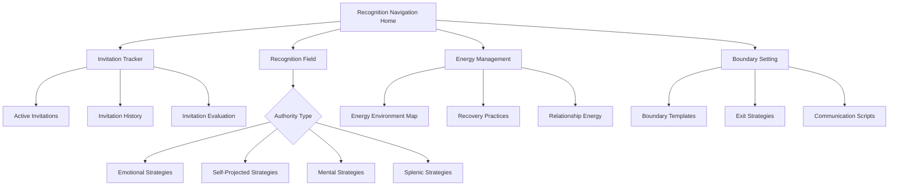

# Recognition Navigation (Projectors)

## Purpose
Help Projectors discern, attract, and navigate optimal invitations and recognition opportunities while preserving their energy and guiding them toward environments where their gifts are seen, appreciated, and properly utilized.

## User Stories & Usage Flows
- As a Projector, I want to identify which invitations align with my unique gifts and energy design
- As a Projector, I want to track energy expenditure in different environments and relationships
- As a Projector, I want to develop strategies for attracting aligned recognition and invitations
- As a Projector, I want to distinguish between correct invitations and conditioned responses
- As a Projector, I want to navigate and gracefully exit environments where I'm not seen

## Authority-Specific Logic

### Emotional Authority (Common for Projectors)
- **Recognition Feature:**
  - Emotion-aware invitation evaluation
  - Emotional clarity timing for invitation responses
  - Recognition quality assessment against emotional wave
  - Waiting period integration for major invitations

- **Background Logic:**
  - Track invitation responses against emotional wave position
  - Calculate ideal waiting periods for different invitation types
  - Identify emotional states that provide clearest invitation discernment
  - Map energy depletion against emotional state during recognition pursuit

- **Navigation Intelligence:**
  - "This invitation arrived during emotional high - consider waiting 2-3 days before responding"
  - "Your pattern shows clearest discernment during emotional neutral or slightly positive states"
  - "Recognition opportunities evaluated during emotional clarity show 70% higher satisfaction"
  - "Your emotional wave typically requires 48-72 hours for full clarity on major invitations"

### Self-Projected Authority (Common for Projectors)
- **Recognition Feature:**
  - Verbal processing recorder for invitation consideration
  - Speaking partner compatibility assessment
  - Before/after clarity comparison for verbal processing
  - Recognition environment vocalization analysis

- **Background Logic:**
  - Track clarity shifts through verbal processing
  - Identify optimal speaking partners for different invitation types
  - Calculate effectiveness of different verbalization approaches
  - Map energy conservation through proper verbal processing

- **Navigation Intelligence:**
  - "Verbal processing with [specific person] consistently yields highest clarity for you"
  - "You reached 80% greater clarity after speaking about this invitation out loud"
  - "Recording shows stronger resonance when discussing aspects X and Y of this opportunity"
  - "Speaking patterns indicate this invitation aligns with your natural expression"

### Mental Authority (Some Projectors)
- **Recognition Feature:**
  - Environmental influence tracker for invitation clarity
  - Diverse perspective collection system
  - Discussion partner recommendation engine
  - Recognition environment compatibility assessment

- **Background Logic:**
  - Track decision clarity across different environments
  - Identify optimal information sources and discussion partners
  - Calculate environmental resonance scores for different contexts
  - Map energy expenditure against environmental factors

- **Navigation Intelligence:**
  - "This environment consistently provides you with recognition alignment clarity"
  - "Discussing invitations with 3+ perspectives shows highest satisfaction in your pattern"
  - "Your clarity increases significantly in [specific environment type]"
  - "Recognition opportunities in these environments show 60% higher energy sustainability"

### Splenic Authority (Some Projectors)
- **Recognition Feature:**
  - Immediate intuitive response recorder for invitations
  - Body sensation mapping for recognition quality
  - Safety and alignment intuition check
  - Energy field assessment for invitation environment

- **Background Logic:**
  - Track intuitive responses to different invitation types
  - Identify physical sensation patterns related to aligned recognition
  - Calculate energy sustainability in different recognition environments
  - Map health impacts of following vs ignoring splenic signals about invitations

- **Navigation Intelligence:**
  - "Your initial splenic response showed caution signals about this invitation's energy alignment"
  - "Physical sensations indicate strong alignment with this recognition opportunity"
  - "Based on your pattern, throat constriction correlates with misaligned invitations"
  - "Your splenic response to this environment shows consistent well-being indicators"

## Features for Projector Recognition

### Invitation Discernment System
- **Special Focus:**
  - Invitation quality assessment framework
  - Authority-aligned evaluation process
  - Recognition intention detection
  - Energy-impact prediction for invitations

- **Unique Features:**
  - "Invitation Quality" score calculator
  - "Authority Alignment" check for invitations
  - "Recognition Intention" analyzer
  - "Energy Impact" predictor for different opportunities

### Recognition Field Cultivation
- **Special Focus:**
  - Personal brand and aura clarity development
  - Strategic visibility planning
  - Gift articulation and communication
  - Aligned audience identification and targeting

- **Unique Features:**
  - "Aura Clarity" development exercises
  - "Strategic Visibility" calendar and planner
  - "Gift Communication" template generator
  - "Aligned Audience" finder and tracker

### Energy Conservation System
- **Special Focus:**
  - Environment energy assessment
  - Relationship energy mapping
  - Activity energy ROI calculation
  - Recovery practice personalization

- **Unique Features:**
  - "Environment Energy" assessment tool
  - "Relationship Energy" mapping visualization
  - "Activity ROI" calculator for energy investment
  - "Recovery Practice" personalized recommendation engine

### Graceful Boundary Setting
- **Special Focus:**
  - Non-invitation detection
  - Graceful exit strategy development
  - Energy protection script creation
  - Redirection techniques for misaligned opportunities

- **Unique Features:**
  - "Non-Invitation Alert" system
  - "Graceful Exit" strategy generator
  - "Energy Protection" script templates
  - "Opportunity Redirection" technique library

## Special Focus Areas by Projector Variation

### Mental Projector
- **Special Considerations:**
  - Information quality and source assessment
  - Environment optimization for mental clarity
  - Discussion partner selection strategies
  - Mental overwhelm prevention systems

- **Tailored Features:**
  - "Information Quality" assessment framework
  - "Environment Optimization" guide for mental clarity
  - "Discussion Partner" compatibility analysis
  - "Mental Overwhelm" early detection and prevention

### Emotional Projector
- **Special Considerations:**
  - Emotional wave tracking integrated with invitation system
  - Clarity timing calculator for different invitation types
  - Emotional transparency in recognition communication
  - Wave-aware energy conservation planning

- **Tailored Features:**
  - "Wave Position" indicator alongside invitations
  - "Clarity Window" predictor for decisions
  - "Emotional Context" for communication templates
  - "Wave-Energy Correlation" tracker

### Energy Projector (Splenic/Sacral Influence)
- **Special Considerations:**
  - Energy sensing and boundary training
  - Immediate recognition quality assessment
  - Physical sensation mapping to invitation alignment
  - Energetic hygiene practices for different environments

- **Tailored Features:**
  - "Energy Sensing" training exercises
  - "Quick Recognition" assessment tool
  - "Physical Alignment" mapping system
  - "Energetic Hygiene" practice library

### Recognition Projector (Self-Projected)
- **Special Considerations:**
  - Voice and expression training
  - Speaking partner compatibility assessment
  - Verbal processing environment optimization
  - Recognition articulation practice

- **Tailored Features:**
  - "Voice & Expression" training modules
  - "Speaking Partner" compatibility testing
  - "Verbal Processing Environment" optimizer
  - "Recognition Articulation" practice system

## Expected Outcomes & User Benefits
- Increased confidence in distinguishing aligned vs misaligned invitations
- Enhanced ability to attract recognition matching authentic gifts
- Improved energy sustainability and prevention of burnout
- Reduced time spent in non-recognizing environments
- Greater satisfaction and impact through aligned opportunities
- Development of clear personal brand and recognition magnetism
- Improved ability to communicate unique gifts and perspectives

## Friction Elimination Features
- Quick invitation assessment with minimal required input
- Voice memo integration for verbal processing
- Calendar integration for waiting periods and clarity timing
- Energy tracking that minimizes manual input through pattern learning
- Context-aware notification system that respects energy needs
- One-tap boundary setting with customizable templates
- Streamlined recovery practice recommendations

## Backend/API Integration

### Required Endpoints:
- `POST /api/v1/recognition/invitation` - Record and evaluate an invitation
  - Payload: `{ invitationType: string, source: string, description: string, timeframe: object, authorityData: object, initialResponse?: string }`
  - Returns: `{ success: boolean, invitationId: string, evaluationSuggestions: string[] }`

- `GET /api/v1/recognition/invitations` - Get recorded invitations with filtering
  - Query parameters: `status: "new"|"evaluating"|"accepted"|"declined", quality?: "high"|"medium"|"low", timeframe?: string`
  - Returns: `{ invitations: Invitation[], patterns: InvitationPattern[] }`

- `POST /api/v1/recognition/evaluation` - Submit authority-specific invitation evaluation
  - Payload: `{ invitationId: string, authorityInput: object, alignmentScore: number, energy: object, notes: string }`
  - Returns: `{ success: boolean, evaluationSummary: object, recommendedResponse?: string }`

- `GET /api/v1/recognition/environments` - Get environment recognition quality analytics
  - Query parameters: `timeframe: string, sortBy: "recognition"|"energy"|"alignment"`
  - Returns: `{ environments: EnvironmentAssessment[], recommendations: string[] }`

- `POST /api/v1/recognition/energy-log` - Record energy expenditure in context
  - Payload: `{ environmentId?: string, relationshipId?: string, activityType: string, energyBefore: number, energyAfter: number, duration: number, context: object }`
  - Returns: `{ success: boolean, energyLogId: string, insights?: string[] }`

- `GET /api/v1/recognition/strategies` - Get personalized recognition strategies
  - Query parameters: `focusArea: string, authorityType: string, energyLevel: string`
  - Returns: `{ strategies: RecognitionStrategy[], practices: Practice[], tailoredAdvice: string[] }`

### Data Models:
```typescript
interface Invitation {
  id: string;
  userId: string;
  timestamp: string;
  invitationType: string; // "work", "relationship", "project", etc.
  source: {
    name: string;
    relationship: string;
    history?: string;
    trustLevel?: number;
  };
  description: string;
  timeframe: {
    receivedAt: string;
    responseDeadline?: string;
    startDate?: string;
    endDate?: string;
  };
  status: "new" | "evaluating" | "accepted" | "declined" | "expired";
  initialResponse?: {
    type: string; // "interest", "hesitation", "excitement", "concern"
    notes: string;
    energyShift: number; // -10 to 10
  };
  evaluation?: {
    authorityType: string;
    authorityInput: object; // Authority-specific data
    clarity: number; // 0-1
    alignment: number; // 0-1
    energyProjection: {
      investment: number;
      return: number;
      sustainability: number;
    };
    recognitionQuality: number; // 0-1
    completedAt: string;
  };
  response?: {
    decision: "accepted" | "declined" | "negotiated";
    reasoning: string;
    communicatedAt: string;
    boundarySet?: string;
  };
  outcome?: {
    recognitionLevel: number; // 0-1
    energyImpact: number; // -10 to 10
    satisfaction: number; // 0-1
    learnings: string[];
    wouldRepeatDecision: boolean;
  };
}

interface InvitationPattern {
  id: string;
  description: string;
  confidence: number; // 0-1
  attributes: {
    sources: string[];
    types: string[];
    recognitionQuality: string[];
    energyImpact: string;
  };
  metrics: {
    acceptanceRate: number;
    satisfactionRate: number;
    energySustainability: number;
    recognitionAlignment: number;
  };
  recommendations: string[];
}

interface EnvironmentAssessment {
  id: string;
  name: string;
  type: string; // "workplace", "social", "family", etc.
  metrics: {
    recognitionQuality: number; // 0-1
    energyImpact: number; // -10 to 10
    invitationFrequency: number;
    alignmentScore: number; // 0-1
  };
  patterns: {
    bestTimes: string[];
    challengeTimes: string[];
    optimalDuration: number; // minutes
    recoveryNeeded: number; // minutes
  };
  relationships: {
    supportive: string[];
    draining: string[];
    neutral: string[];
  };
  recommendations: {
    boundarySettings: string[];
    energyStrategies: string[];
    visibilityTactics: string[];
  };
}

interface RecognitionStrategy {
  id: string;
  name: string;
  description: string;
  authorityAlignment: string[];
  energyRequirement: number; // 1-10
  effectiveness: number; // 0-1
  implementationSteps: string[];
  bestFor: string[];
  cautionsFor: string[];
  examples: string[];
  personalizedNotes?: string;
}

interface Practice {
  id: string;
  name: string;
  description: string;
  category: string; // "energy", "visibility", "communication", etc.
  duration: number; // minutes
  frequency: string;
  steps: string[];
  benefits: string[];
  authoritySpecificNotes: Record<string, string>;
}
```

## Edge Cases & Validation
- Handle mixed-signal invitations with clarity assessment tools
- Support invitations that change nature after initial acceptance
- Account for energy fluctuations affecting invitation discernment
- Validate recognition quality over time with satisfaction tracking
- Handle urgent vs. important invitation prioritization
- Support various relationship dynamics and power imbalances
- Process invitation patterns across different life domains
- Manage conditional or partial invitations with boundary setting

## Wireframe Sketch



## Developer Notes
- Implement multi-modal invitation recording (text, voice, calendar integration)
- Create authority-specific evaluation algorithms with adaptable parameters
- Design recognition quality assessment with multiple weighted factors
- Build energy tracking analytics that learn from minimal user input
- Implement invitation pattern detection with statistical confidence scoring
- Create environment assessment with both manual and automatic data collection
- Design user experience that feels supportive and patient for Projectors
- Consider integration with calendar and communication tools for invitation management

## Natural Usage Examples

### Emotional Projector
- Invitation log: "Speaking opportunity at industry conference" + Emotional state: "Excited, high" → System flags: "Consider waiting 48-72 hours for emotional clarity before deciding"
- Evaluation: After emotional cycle → "This invitation maintains strong alignment through emotional wave - recognition quality prediction: High"
- Energy assessment: "Similar speaking engagements show positive energy ROI when limited to 60 minutes with 24-hour recovery"
- Recognition strategy: "For highest recognition in speaking engagements, focus on unique perspective rather than comprehensive coverage"

### Self-Projected Projector
- Invitation review: "Job offer from Company X" + Verbal processing: Voice recording with trusted friend → Analysis: "Vocal tone shows consistent excitement when discussing creative aspects but tension when discussing team structure"
- Clarity assessment: "Verbal processing increased clarity from 40% to 85% - primary concerns identified through speech pattern changes"
- Recognition strategy: "Negotiate for role emphasis on identified areas of vocal enthusiasm"
- Boundary template: "If accepting, communicate clear working preferences based on verbal processing insights"

### Mental Projector
- Invitation assessment: "Partnership opportunity" + Environmental processing: Collected 4 perspectives, assessed in 2 different environments → Analysis: "Highest clarity achieved after outdoor discussion with diverse perspectives"
- Environment recommendation: "Schedule key decision-making after processing in natural settings with trusted advisors"
- Recognition strategy: "Articulate unique perspective value in written form before partnership discussions"
- Energy conservation: "Limit partnership meetings to 90 minutes with 30-minute solo integration time afterward"

### Splenic Projector
- Invitation quick assessment: "Collaboration request" + Immediate splenic response: "Throat tightening, solar plexus activation" → Analysis: "Physical signals indicate caution about energy alignment"
- Environment scan: "Previous collaborations with this source showed 30% energy depletion despite initial enthusiasm"
- Boundary setting: "Customized limited-scope template provided for partial acceptance while preserving energy"
- Recognition guidance: "Your clearest recognition comes in environments where physical comfort remains consistent throughout engagement"
</content>
</invoke>
