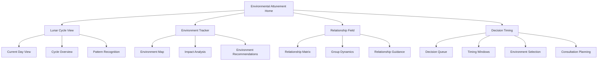

# Environmental Attunement (Reflectors)

## Purpose
Help Reflectors track, evaluate, and navigate their unique experiences across the lunar cycle while identifying supportive environments, relationships, and circumstances that allow their reflective wisdom to emerge and guide their decisions.

## User Stories & Usage Flows
- As a Reflector, I want to track my experiences through the 28-day lunar cycle to identify patterns and clarity moments
- As a Reflector, I want to evaluate environments and relationships by how they impact my wellbeing
- As a Reflector, I want guidance for timing decisions in alignment with my lunar authority
- As a Reflector, I want to distinguish between my authentic wisdom and conditioning from others
- As a Reflector, I want to identify and seek out environments that support my unique reflective nature

## Authority-Specific Logic

### Lunar Authority (Primary for Reflectors)
- **Attunement Feature:**
  - Complete lunar cycle tracking with daily check-ins
  - Environmental impact assessment linked to lunar day
  - Decision timing advisor based on personal lunar patterns
  - Relationship and location impact mapping

- **Background Logic:**
  - Track wellbeing and clarity across complete 28-day cycle
  - Calculate optimal decision timing based on personal patterns
  - Identify environmental factors most strongly influencing experience
  - Map consistency/inconsistency patterns across moon cycles

- **Attunement Intelligence:**
  - "Based on your patterns, lunar days 25-28 consistently show highest clarity for major decisions"
  - "Environments with [specific attributes] correlate with your highest reported wellbeing"
  - "This relationship shows 70% correlation with positive states during waxing moon phases"
  - "Your most consistent clarity emerges after experiencing 3+ distinct environments during decision consideration"

## Primary Reflector Attunement Features

### Lunar Cycle Navigator
- **Special Focus:**
  - Personalized lunar cycle tracking
  - Phase correlation with decision clarity
  - Optimal timing calculator for different decision types
  - Pattern recognition across multiple lunar cycles

- **Unique Features:**
  - "Lunar Day Tracker" with personal correlation data
  - "Decision Timing" advisor based on lunar patterns
  - "Clarity Window" predictor for different decisions
  - "Multi-Cycle Pattern" recognition system

### Environmental Wisdom System
- **Special Focus:**
  - Environment quality assessment framework
  - Location impact tracking on wellbeing
  - Environmental transition guidance
  - Space design recommendations for optimal reflection

- **Unique Features:**
  - "Environment Quality" score calculator
  - "Location Impact" tracking visualization
  - "Transition Guide" for moving between environments
  - "Space Design" personalized recommendations

### Relationship Field Mapping
- **Special Focus:**
  - Relationship impact assessment
  - Social configuration wisdom
  - Group dynamics navigation
  - Solitude balance optimization

- **Unique Features:**
  - "Relationship Impact" assessment tool
  - "Social Configuration" wisdom generator
  - "Group Dynamics" navigation guide
  - "Solitude Balance" optimization calculator

### Authentic Self Recognition
- **Special Focus:**
  - Self vs. other differentiation training
  - Conditioning detection system
  - Authentic wisdom amplification techniques
  - Reflective clarity cultivation practices

- **Unique Features:**
  - "Self vs. Other" differentiation exercises
  - "Conditioning Detection" alert system
  - "Authentic Wisdom" amplification tools
  - "Reflective Clarity" cultivation practices

## Special Focus Areas for Reflector Variations

### Community-Oriented Reflector
- **Special Considerations:**
  - Group dynamics impact on lunar cycle
  - Community wisdom extraction techniques
  - Social environment optimization
  - Group conditioning awareness

- **Tailored Features:**
  - "Group Dynamics" lunar impact tracker
  - "Community Wisdom" extraction tools
  - "Social Environment" optimization guide
  - "Group Conditioning" awareness exercises

### Nature-Connected Reflector
- **Special Considerations:**
  - Natural environment impact tracking
  - Nature immersion timing optimization
  - Seasonal pattern correlation with lunar cycle
  - Elemental balance assessment

- **Tailored Features:**
  - "Natural Environment" impact tracker
  - "Nature Immersion" timing optimizer
  - "Seasonal Pattern" correlation system
  - "Elemental Balance" assessment tool

### Highly Sensitive Reflector
- **Special Considerations:**
  - Subtle environmental influences tracking
  - Sensory input management techniques
  - Energetic hygiene practices
  - Threshold awareness and management

- **Tailored Features:**
  - "Subtle Influence" tracking system
  - "Sensory Management" technique library
  - "Energetic Hygiene" practice guide
  - "Threshold Awareness" management tools

### Wisdom-Sharing Reflector
- **Special Considerations:**
  - Wisdom articulation timing optimization
  - Expression medium recommendations
  - Audience resonance assessment
  - Reflective insight documentation system

- **Tailored Features:**
  - "Wisdom Articulation" timing optimizer
  - "Expression Medium" recommendation engine
  - "Audience Resonance" assessment tool
  - "Reflective Insight" documentation system

## Expected Outcomes & User Benefits
- Increased confidence in timing decisions aligned with personal lunar cycle
- Enhanced ability to identify and seek supportive environments
- Improved relationship clarity and boundary setting
- Reduced conditioning through heightened self-awareness
- Greater appreciation for unique reflective wisdom
- More consistent wellbeing through environmental attunement
- Deeper trust in personal timing and environmental needs

## Friction Elimination Features
- One-tap lunar day check-ins with minimal required input
- Automatic lunar phase tracking with personalized overlay
- Environment assessment through quick image capture or preset tags
- Voice memo integration for reflective insights
- Predictive wellbeing suggestions based on lunar day and past patterns
- Location-based environment reminders and insights
- Streamlined decision timing recommendations

## Backend/API Integration

### Required Endpoints:
- `POST /api/v1/lunar/check-in` - Record daily lunar cycle check-in
  - Payload: `{ lunarDay: number, wellbeingScore: number, clarity: number, environment: object, significant: boolean, notes?: string }`
  - Returns: `{ success: boolean, checkInId: string, insights?: string[], patternUpdates?: object }`

- `GET /api/v1/lunar/cycle` - Get lunar cycle analytics
  - Query parameters: `cycleStart: string, includePatterns: boolean, focusArea?: string`
  - Returns: `{ cycleData: LunarDayData[], patterns: LunarPattern[], predictedWindows: ClarityWindow[] }`

- `POST /api/v1/environment/assessment` - Record environment assessment
  - Payload: `{ environmentId?: string, name: string, type: string, attributes: string[], impact: object, lunarDay: number, photos?: string[] }`
  - Returns: `{ success: boolean, environmentId: string, recommendations?: string[] }`

- `GET /api/v1/environment/analytics` - Get environment impact analytics
  - Query parameters: `timeframe: string, sortBy: "wellbeing"|"clarity"|"consistency", environmentType?: string`
  - Returns: `{ environments: EnvironmentAnalysis[], insights: string[], recommendations: string[] }`

- `POST /api/v1/relationship/assessment` - Record relationship impact
  - Payload: `{ relationshipId?: string, person: string, type: string, impact: object, context: object, lunarDay: number }`
  - Returns: `{ success: boolean, relationshipId: string, insights?: string[] }`

- `GET /api/v1/decisions/timing` - Get decision timing recommendations
  - Query parameters: `decisionType: string, importance: number, timeframe: string`
  - Returns: `{ recommendedWindows: TimingWindow[], waitingPeriod: string, environmentSuggestions: string[] }`

### Data Models:
```typescript
interface LunarCheckIn {
  id: string;
  userId: string;
  timestamp: string;
  lunarDay: number; // 1-28
  lunarPhase: string;
  wellbeing: {
    overall: number; // 1-10
    physical: number;
    emotional: number;
    mental: number;
    social: number;
  };
  clarity: {
    level: number; // 1-10
    areas: string[];
    insights: string[];
  };
  environment: {
    id?: string;
    name: string;
    type: string;
    attributes: string[];
    duration: number; // hours
    impact: number; // -10 to 10
  };
  relationships: {
    people: string[];
    groupSize?: number;
    dynamics: string[];
    impact: number; // -10 to 10
  };
  significant: boolean;
  notes?: string;
  decisions?: {
    considered: string[];
    made: string[];
    satisfaction?: number;
  };
}

interface LunarPattern {
  id: string;
  description: string;
  confidence: number; // 0-1
  cyclePosition: {
    days: number[]; // 1-28
    phase?: string[];
  };
  attributes: {
    wellbeing: string;
    clarity: string;
    environmentFactors: string[];
    relationshipFactors: string[];
  };
  consistency: {
    acrossCycles: number; // 0-1
    withinPhases: number; // 0-1
    exceptions: string[];
  };
  recommendations: string[];
}

interface ClarityWindow {
  startDay: number; // 1-28
  endDay: number; // 1-28
  confidence: number; // 0-1
  decisionTypes: string[];
  environmentRecommendations: string[];
  preparation: string[];
}

interface EnvironmentAnalysis {
  id: string;
  name: string;
  type: string;
  frequency: number; // times visited
  lunarCorrelation: {
    bestDays: number[]; // 1-28
    challengingDays: number[]; // 1-28
    neutralDays: number[]; // 1-28
  };
  impact: {
    wellbeing: number; // -10 to 10
    clarity: number; // -10 to 10
    energy: number; // -10 to 10
    authenticity: number; // -10 to 10
  };
  attributes: {
    supportive: string[];
    challenging: string[];
    neutral: string[];
  };
  recommendations: {
    timing: string[];
    duration: string;
    preparation: string[];
    integration: string[];
  };
}

interface RelationshipAnalysis {
  id: string;
  person: string;
  type: string;
  frequency: number; // interactions
  lunarCorrelation: {
    bestDays: number[]; // 1-28
    challengingDays: number[]; // 1-28
    neutralDays: number[]; // 1-28
  };
  impact: {
    wellbeing: number; // -10 to 10
    clarity: number; // -10 to 10
    energy: number; // -10 to 10
    authenticity: number; // -10 to 10
  };
  dynamics: {
    supportive: string[];
    challenging: string[];
    neutral: string[];
  };
  recommendations: {
    timing: string[];
    duration: string;
    boundaries: string[];
    communication: string[];
  };
}

interface TimingWindow {
  startDate: string;
  endDate: string;
  lunarDays: number[];
  confidence: number; // 0-1
  recommendedEnvironments: string[];
  recommendedConsultations: string[];
  preparation: string[];
  notes: string;
}
```

## Edge Cases & Validation
- Handle missing check-ins with adaptive pattern detection
- Support lunar cycle irregularities and pattern shifts
- Account for major life transitions affecting baseline patterns
- Validate environmental impact consistency across multiple cycles
- Handle relationship dynamics changes over time
- Support complex decision processes spanning multiple lunar cycles
- Process conditioning detection with nuanced pattern recognition
- Manage environmental transitions with appropriate guidance

## Wireframe Sketch



## Developer Notes
- Implement adaptive lunar cycle tracking that accommodates missed days
- Create environment assessment with multi-factorial analysis
- Design relationship impact tracking with nuanced qualitative factors
- Build pattern detection algorithms that improve with longitudinal data
- Implement conditioning detection with baseline-deviation analysis
- Create decision timing recommendations that integrate multiple factors
- Design user experience that feels spacious and contemplative for Reflectors
- Consider location-based features for environmental tracking and recommendations

## Natural Usage Examples

### Community-Oriented Reflector
- Lunar check-in: Day 14, Wellbeing: 8/10, Environment: "Community garden workday" → Pattern insight: "Community environments consistently rate highest during lunar days 12-16"
- Environment assessment: "Open office workspace" during lunar day 21 → Impact: "Reduced clarity (-40%) compared to same lunar day in quieter settings"
- Decision timing: Major career decision → Recommendation: "Wait for lunar days 26-28 based on your pattern, ideally after experiencing 3+ different social configurations"
- Relationship insight: "Group settings of 4-7 people correlate with your highest clarity during lunar days 20-24"

### Nature-Connected Reflector
- Environment correlation: "Natural settings show 80% higher clarity ratings across all lunar phases compared to urban environments"
- Decision timing: Housing change → Recommendation: "Schedule site visits during lunar days 18-22 when your environmental discernment is strongest"
- Lunar pattern: "Time in forests during waning moon consistently precedes your clearest decision windows"
- Authentic wisdom: "Your nature-based insights on lunar days 3-5 have proven 90% accurate in retrospective analysis"

### Highly Sensitive Reflector
- Environment assessment: "Sensory elements most impacting wellbeing: ambient noise level, natural light, air quality"
- Lunar sensitivity: "Your sensitivity threshold shows predictable changes across lunar cycle - most sensitive during lunar days 9-12"
- Relationship insight: "One-on-one interactions rated 60% more supportive than groups during sensitive lunar phases"
- Decision guidance: "For major decisions, document sensory impressions of environments during consideration period - patterns emerge in review"

### Wisdom-Sharing Reflector
- Lunar wisdom pattern: "Your most unique insights consistently emerge during lunar days 23-26 after social interaction followed by solitude"
- Expression recommendation: "Voice recording shows 40% higher clarity than written expression during current lunar phase"
- Environment assessment: "Mixed environments (3+ types within 24 hours) consistently precede your strongest wisdom articulation"
- Audience resonance: "Your reflective insights find strongest reception when shared during recipients' low-pressure periods"
</content>
</invoke>
