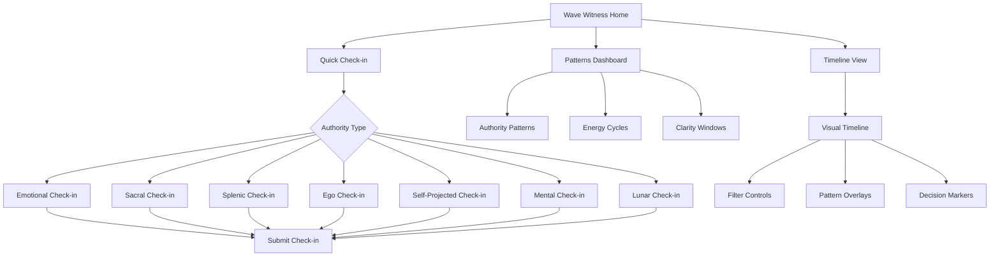

# Wave Witness

## Purpose
Track personal energy rhythms without clinical detachment or forced analysis to reveal natural patterns, optimal decision timing, and energy management strategies aligned with your unique Human Design authority.

## User Stories & Usage Flows
- As a user, I want to easily track my energy and mood patterns to identify my natural rhythms
- As a user, I want to record energy levels without extensive analysis or judgment
- As a user, I want visual representations of my energy patterns over time
- As a user, I want authority-specific insights about my optimal decision-making timing
- As a user, I want to understand when I'm in a clarity state based on my authority type

## Authority-Specific Logic

### Emotional Authority
- **Check-in UI:**
  - Morning/evening energy check-ins (required) with option for midday or significant swings
  - "Where are you on your emotional wave?" slider with visual wave representation
  - Options: "High," "Climbing," "Neutral," "Descending," "Low" + intensity scale
  - Optional emotional weather tags: "Clear," "Stormy," "Electric," "Calm," etc.

- **Background Logic:**
  - Track daily wave patterns and establish baseline wave cycles (typically 3-7 days)
  - Identify peak-to-valley patterns and calculate average clarity periods
  - Map decision points against emotional state

- **Pattern Surfacing:**
  - Highlight stability periods after waves with "Potential clarity moment" notifications
  - Surface insights like "Your emotional wave typically stabilizes 2-3 days after peaks"
  - Suggest: "Based on your patterns, Tuesday-Thursday may be your best decision window"

### Sacral Authority
- **Check-in UI:**
  - "How energized do you feel today? (1-10)" slider
  - "Is your gut saying yes/no to today's main activities?" toggle selection
  - Energy allocation visual: distribute energy units across life areas
  - Quick "Response check" for pending decisions with gut response recording

- **Background Logic:**
  - Track energy levels by time of day, day of week, activity type
  - Correlate gut responses with energy levels and outcomes
  - Identify energy drain vs. energy gain activities

- **Pattern Surfacing:**
  - "Your gut said yes most consistently between 10am-2pm"
  - "Mondays are typically your highest energy days"
  - "Activities X, Y, Z consistently drain your energy despite 'yes' response"

### Splenic Authority
- **Check-in UI:**
  - "Did you have a spontaneous intuition today?" Yes/No + intensity
  - "Did you listen to it?" Yes/No + outcome if known
  - Body sensation mapping: select areas where intuition was felt
  - Environment factors when intuition occurred

- **Background Logic:**
  - Track intuition frequency, intensity, and accuracy over time
  - Correlate environmental factors with intuitive clarity
  - Map physical sensations to intuition accuracy

- **Pattern Surfacing:**
  - "Your splenic hits were most accurate in the morning/with these people"
  - "You tend to feel strong intuitions in your [body area] when [condition]"
  - "You've ignored X% of intuitions that later proved accurate"

### Ego Authority
- **Check-in UI:**
  - "How determined is your focus today? (slider)"
  - "Do you feel ready to commit to anything?" Yes/No + description
  - "Heart center check-in" - rate alignment between desires and actions
  - Willpower assessment: "Current willpower reserves (1-10)"

- **Background Logic:**
  - Track willpower cycles throughout day/week
  - Identify correlation between willpower strength and commitment satisfaction
  - Monitor alignment between stated desires and commitments made

- **Pattern Surfacing:**
  - "Your willpower is typically strongest early in the week"
  - "You show consistent decision satisfaction when willpower rated 8+"
  - "There's misalignment between recent commitments and stated desires"

### Self-Projected Authority
- **Check-in UI:**
  - "Did you talk out loud or journal your thoughts today?" Yes/No + details
  - "Rate clarity before/after speaking" comparison slider
  - Voice note option with "How did this feel when spoken?" prompt
  - Track who you spoke with and environment

- **Background Logic:**
  - Track clarity shifts before/after speaking
  - Correlate speaking partners with clarity levels
  - Monitor environment influence on verbal processing

- **Pattern Surfacing:**
  - "Clarity increased after speaking on days X/Y"
  - "Speaking with [person] consistently improved your clarity"
  - "Solo verbal processing yields higher clarity than group settings for you"

### Mental Authority
- **Check-in UI:**
  - "What environments were you in today?" selection
  - "Who did you interact with?" selection
  - "Rate mental clarity in different environments" comparative slider
  - "Did discussions lead to new perspectives?" Yes/No + notes

- **Background Logic:**
  - Map clarity levels to environments and social contexts
  - Track perspective shifts after discussions
  - Identify optimal environmental conditions for clarity

- **Pattern Surfacing:**
  - "You consistently report higher clarity in [environment type]"
  - "Discussions with diverse perspectives correlate with your best decisions"
  - "Your optimal decision environment appears to be [specific conditions]"

### Lunar Authority (Reflector)
- **Check-in UI:**
  - Auto-tracking of lunar phase with visual indicator
  - "What was your environment today?" with context inputs
  - "Who did you interact with?" multi-select
  - Energy and clarity rating relative to lunar cycle

- **Background Logic:**
  - Map energy and clarity to specific lunar days (in 28-day cycle)
  - Correlate environmental factors with wellbeing across cycle
  - Track decision satisfaction against lunar phase when decision was made

- **Pattern Surfacing:**
  - "You feel most clear around new/full moon"
  - "Your energy is consistently higher after group activities during waxing moon"
  - "Decisions made during days 24-28 of your lunar cycle show highest satisfaction"

## Expected Outcomes & User Benefits
- Natural rhythm awareness without forced tracking
- Optimal decision timing recognition based on authority type
- Energy allocation wisdom personalized to individual patterns
- Reduced decision fatigue through authority-aligned timing
- Greater awareness of personal clarity indicators
- Improved energy management strategies

## Friction Elimination Features
- Single-tap energy check-ins (10 seconds or less)
- Optional reminder notifications based on authority type
- Automatic pattern detection without manual analysis
- Visual pattern displays without requiring data interpretation
- No guilt messaging for missed check-ins
- Flexible tracking frequency based on authority needs
- Personal anchor points instead of absolute scales
- Natural language pattern summaries

## Backend/API Integration

### Required Endpoints:
- `POST /api/v1/wave-witness/check-in` - Record energy/authority check-in
  - Payload: `{ timestamp: string, checkInType: string, authorityData: object, energyLevel: number, contextData?: object }`
  - Returns: `{ success: boolean, entry_id: string }`

- `GET /api/v1/wave-witness/patterns` - Get authority-specific energy patterns
  - Query parameters: `timeframe: "week"|"month"|"year", patternTypes: string[]`
  - Returns: `{ patterns: EnergyPattern[], insights: string[] }`

- `GET /api/v1/wave-witness/timeline` - Get visual timeline data
  - Query parameters: `startDate, endDate, resolution: "day"|"week"|"month"`
  - Returns: `{ timelinePoints: TimelinePoint[], annotations: TimelineAnnotation[] }`

- `GET /api/v1/wave-witness/clarity-prediction` - Get authority-specific clarity predictions
  - Returns: `{ predictions: ClarityPrediction[], confidence: number }`

- `PUT /api/v1/wave-witness/decision-outcome` - Record decision outcome for correlation
  - Payload: `{ decisionId: string, satisfaction: number, notes: string }`
  - Returns: `{ success: boolean, updatedInsights?: string[] }`

### Data Models:
```typescript
interface EnergyCheckIn {
  id: string;
  userId: string;
  timestamp: string;
  energyLevel: number; // 1-10
  authorityData: {
    type: string; // "emotional", "sacral", "splenic", etc.
    state?: string; // Authority-specific state
    metrics?: object; // Authority-specific measurements
  };
  contextData?: {
    location?: string;
    activities?: string[];
    people?: string[];
    environment?: string;
    lunarPhase?: string;
    notes?: string;
  }
}

interface EnergyPattern {
  id: string;
  description: string;
  confidence: number; // 0-1
  patternType: string; // "wave-cycle", "energy-peak", "clarity-window", etc.
  timeframe: {
    cycleLength?: number; // In days
    peakDays?: number[]; // Days of week or month
    timeOfDay?: string[]; // Morning, afternoon, evening
  };
  authoritySpecificData?: object;
}

interface TimelinePoint {
  timestamp: string;
  energyLevel: number;
  authorityMetrics: object; // Authority-specific data points
  tags?: string[];
}

interface ClarityPrediction {
  startTime: string;
  endTime: string;
  clarityLevel: number; // 0-1
  authorityBasis: string; // Description of why this is predicted
  recommendedUse: string; // How to use this clarity window
}
```

## Edge Cases & Validation
- Handle sporadic check-in behavior with adaptive insights
- Normalize data across different check-in frequencies
- Provide meaningful patterns even with minimal data
- Account for external factors (illness, travel, etc.)
- Handle authority type changes gracefully
- Validate patterns with statistical significance before surfacing
- Support manual correction of anomalous data points

## Wireframe Sketch



## Developer Notes
- Use rolling statistical analysis for pattern detection
- Implement different pattern detection algorithms per authority type
- Create a flexible schema for authority-specific metrics
- Use small batches of insights rather than overwhelming users with all patterns
- Consider implementing machine learning for advanced pattern detection as dataset grows
- Ensure time series database optimization for efficient querying
- Develop reusable visualization components for timeline representations
- Implement privacy controls for sensitive energy data

## Natural Usage Examples

### Emotional Authority
- Morning check-in: Quick tap "6/10" energy level, "Ascending" wave position
- Evening check-in: Tap "4/10" energy, "Descending" wave position, "Scattered" tag
- Weekly review shows: "Your emotional wave typically completes a cycle every 5 days with clarity best on day 3"

### Sacral Authority
- Quick mid-day check: Energy "7/10", Gut saying "yes" to primary activities
- Work project review: Energy allocation shows 60% to creative tasks, 30% to meetings, 10% to admin
- Pattern insight: "Your energy peaks on Tuesdays and is most responsive between 10am-2pm"

### Splenic Authority
- Morning intuition log: "Strong intuition about project direction" + Listened: Yes + Body area: Solar plexus
- Weekly review: "Your spontaneous intuitions were most accurate when felt in the chest area"

### Lunar Authority (Reflector)
- Daily environment log: "Worked from shared office" + people: "Team members" + lunar day: 14
- Monthly review: "You consistently report highest clarity on lunar days 25-28, especially in natural settings"
